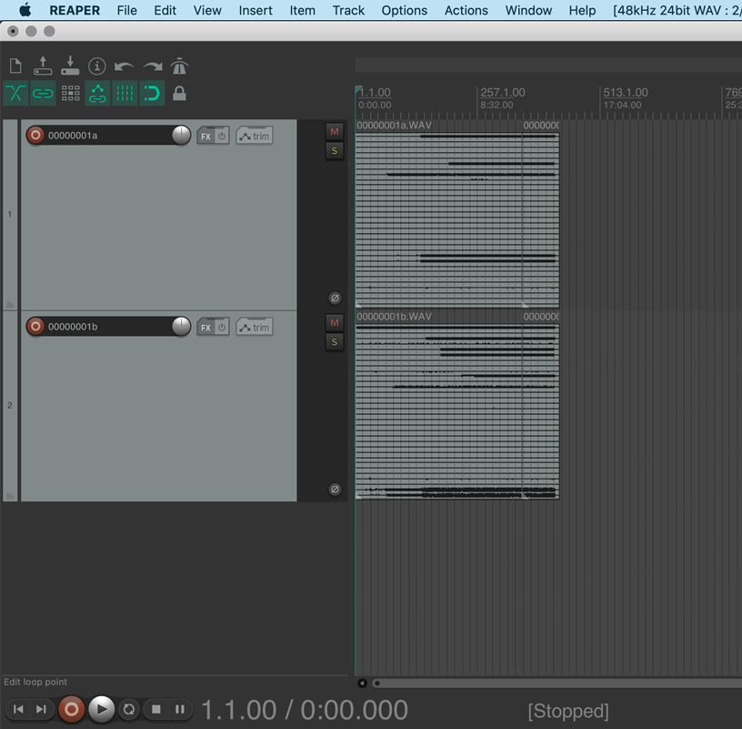
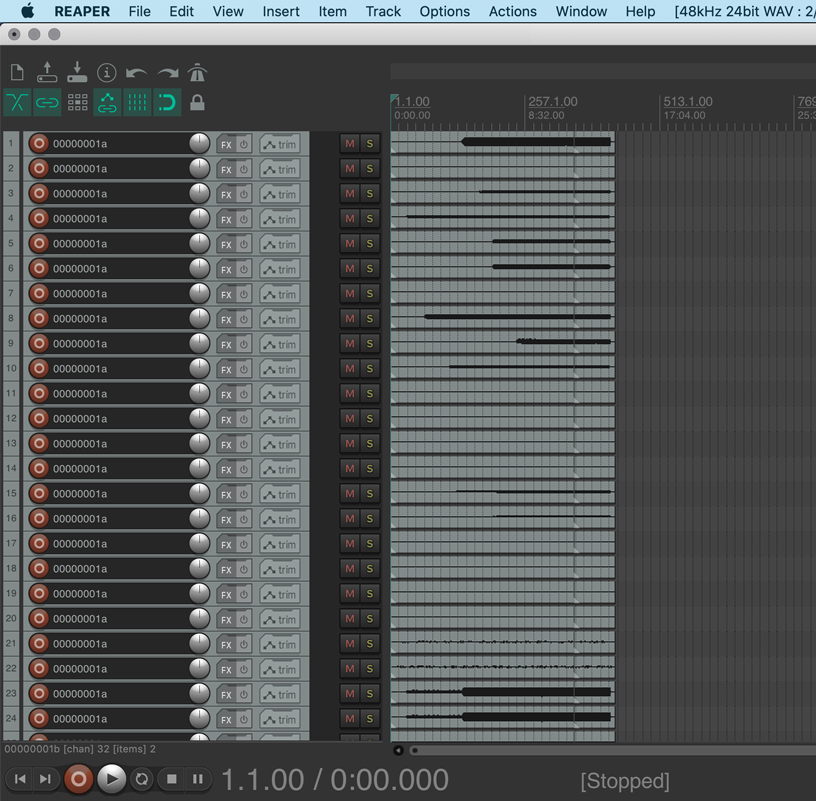
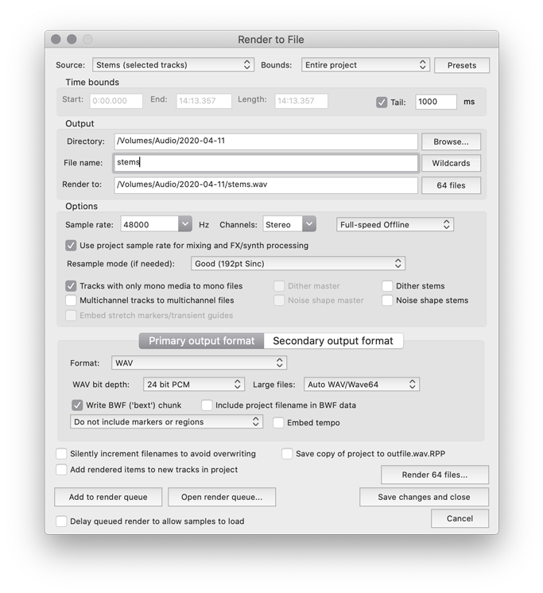

# W-LIVE 64 track separation

## Turn Behringer WING W-LIVE files from your SD cards into individual tracks

Start with a track for each SD card's WAVs. If the recording exceeds the 4GB limit and the WAVs are chunked, just drop the extra chunks in order on the track.

Import and run `W-LIVE 64 track separation.lua` to turn the WAVs into 64 separate mono tracks.

Note that each track is still 32-channel PCM wave audio, so this will be heavy on the CPU. Just render the stems:

I've added a table of track names to the script - edit this to have your Reaper tracks named correctly.
